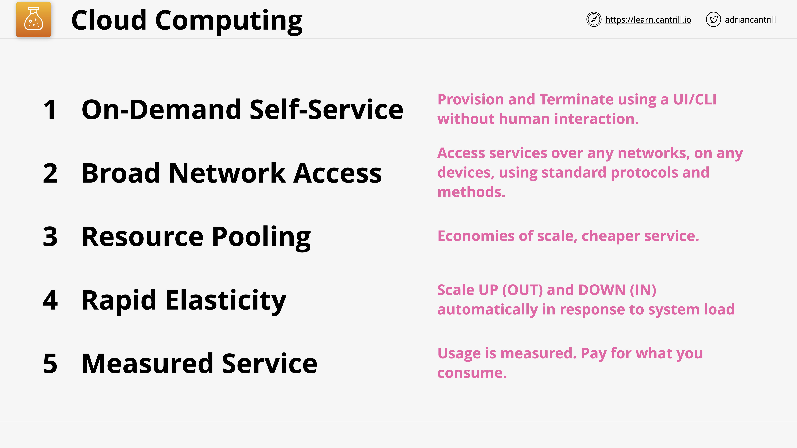
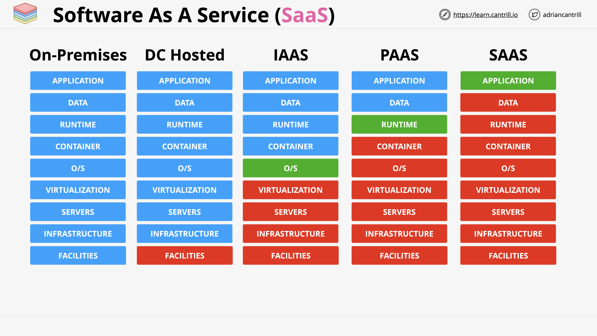

# SAA-C03-Notes
AWS Certified Solutions Architect - Associate (SAA-C03) Notes from Cantrill Course

### AWS Account Setup
- Create and verify account.
- Add alternate contacts.
- Allow IAM Users to access billing information.
- Add Multi-Factor Authentication (MFA) to root account.
- Create Budgets.
- Add IAM Admin User with AdministratorAccess and setup account alias and sign in URL.
- Add Multi-Factor Authentication (MFA) to IAM Admin User.
- Create IAM Access Key for Admin User.

## Cloud Computing Fundamentals
### What is Cloud Computing?

Cloud computing is the on-demand delivery of IT resources and applications via the internet with pay-as-you-go pricing.

### Public Vs Private Vs Hybrid Vs Multi Cloud

**Public Cloud: Using 1 public cloud.**
> Cloud services provided by a third-party cloud service provider over the internet and its available to the general public.

**Private Cloud: Using on-premises *real* cloud.**
> Cloud services provided by a third-party cloud service provider over the internet thats dedicated to a single organization. Examples: AWS Outposts, Azure Stack, Google Anthos.

**Multi Cloud: Using more than 1 public cloud.**

**Hybrid Cloud: Using a mix of Public cloud and Private cloud.**

~~Hybrid Cloud is NOT public cloud + legacy on-
premises~~

### Cloud Service Models
Infrastructure as a Service (IaaS): 

Provides virtualized compute resources. Where you get access to **OS** level and above. Everything below the stack managed by provider. 
Examples: AWS EC2, Azure VMs, Google Compute Engine.

Platform as a Service (PaaS):

Provides a platform to develop, run, and manage applications. Where you get access to **RUNTIME** level and above. Everything below the stack managed by provider. Examples: AWS Elastic Beanstalk, Azure App Service, Google App Engine, Heroku.

Software as a Service (SaaS):

Provides a complete application. Where you get access to **APPLICATION** level. Everything else managed by provider. Examples: AWS WorkMail, Azure Office 365, Google G Suite, Netflix.

Functions as a Service (FaaS)

Containers as a Service (CaaS)

Data as a Service (DBaaS)

